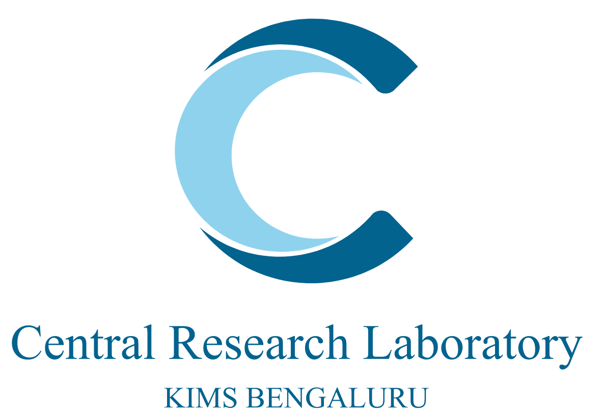

# Bioinformatics Course: Genomic Surveillance of *Streptococcus pneumoniae* and *Streptococcus agalactiae*
*Adapted from the course: Advanced Bioinformatics Course developed for the GPS and JUNO projects.*

## Summary

The Global Pneumococcal Sequencing (GPS) project is a worldwide network for genomic surveillance of *Streptococcus pneumoniae* providing evidence for pneumococcal disease control. The JUNO project is a global genomic surveillance of *Streptococcus agalactiae*, a major cause of neonatal invasive disease worldwide. One of the main objectives of the GPS and JUNO projects is to strengthen the capacity of our project collaborators in the generation and analysis of genomic data. This course is designed to train participants in genomic surveillance of *S. agalactiae* and *S. pneumoniae*. Through this program, attendees will gain essential knowledge and skills for the generation, analysis, and interpretation of genomic data relevant to these pathogens. This course aims to provide participants with the necessary tools to conduct effective genomic surveillance, thus contributing to the control and prevention of diseases caused by *S. agalactiae* and *S. pneumoniae*.

## Learning Objectives

- Understand the basics of next-generation sequencing using Illumina and Nanopore platforms.
- Learn to handle the Linux command line.
- Identify NGS file formats.
- Apply command-line tools to perform data quality control on generated reads.
- Assemble reads, examine the assembly output, and evaluate the quality of assembled reads.
- Annotate and visualize the annotated genome.
- Perform serotyping, MLST, and find antibiotic-resistant genes in bacterial genomes from Latin American public data.
- Perform indexing of the reference genome, read mapping, conversion of output to SAM/BAM format, and variant calling using bwa on *S. pneumoniae* data.
- Explain and perform phylogenetic analysis, including reading phylogenetic trees, identifying recombination regions, and clustering using.
- Understand and use bioinformatics pipelines for genomic surveillance of *S. pneumoniae* and *S. agalactiae*.

## Target Audience

This Advanced Bioinformatics Course is aimed at students, researchers, or clinical/health professionals who are part of these global surveillance networks or who are interested in learning how to carry out next-generation sequencing (NGS) and analysis of bacterial genomes (i.e., *Streptococcus pneumoniae* and/or *Streptococcus agalactiae*). This course will focus on the application of cutting-edge genomic techniques that are currently being implemented.

## General Requirements

Before starting this advanced bioinformatics course, it is recommended to have reviewed or completed the following courses:
"[Fundamental module 1 (F1)](https://training.bactgen.sanger.ac.uk/#/F1/)"
"[Fundamental module 2 (F2)](https://training.bactgen.sanger.ac.uk/#/F2/)"

## Program

### Module 1: [Introduction to Google Colaboratory](https://github.com/cabana-online/Tutorial_Introduccion/blob/main/01.Intro_a_colab.ipynb)

Modules 1, 2 and 3 can be found in the repository [Introduction](https://github.com/cabana-online/Introduction_tutorial)

To get started, go to https://colab.research.google.com/.

On the Colab homepage, select "File" and then "Open notebook".

There is a tab for "GitHub"; select that tab and paste the following URL into the search bar under "Enter a GitHub URL or search by organization or user":

`https://github.com/cabana-online/Introduction_tutorial`

After a brief search, you will see the notebook:

`01.Intro_a_colab.ipynb`

Select it and you will see the notebook open.

To run the cells, you will need to sign in with your Google account (feel free to create an account). Using Colab is free. 

**Note:** there are limitations in the free version, but they will not be reached in this course.

### Module 2: [Introduction to Notebooks and Unix/Linux](https://github.com/cabana-online/Introduction_tutorial/blob/main/02.Module_2_linux.ipynb)

Go to https://colab.research.google.com/.

Select the repository

`https://github.com/cabana-online/Introduction_tutorial `

After a brief search, you will see the notebook:

`02.Modulo_2_linux.ipynb`

Select it and you will see the notebook open.

### Module 3: [Introduction to NGS Technologies](https://github.com/cabana-online/Introduction_tutorial/blob/main/03.Module_3_NGS.ipynb)

Go to https://colab.research.google.com/.

Select the repository

`https://github.com/cabana-online/Introduction_tutorial`

After a brief search, you will see the notebook:

`03.Modulo_3_NGS.ipynb`

Select it and you will see the notebook open.

### Module 4: [Data Quality Control](04.Module_4_QC.ipynb)

Go to https://colab.research.google.com/.

Select the repository

`https://github.com/cabana-online/Genomic_surveillance`

After a brief search, you will see the notebook:

`04.Module_4_QC.ipynb`

Select it and you will see the notebook open.

### Module 5: [Taxonomic Classification of Sequences](05.Module_5_taxonomy.ipynb)

Go to https://colab.research.google.com/.

Select the repository

`https://github.com/cabana-online/Genomic_surveillance`

After a brief search, you will see the notebook:

`05.Module_5_taxonomy.ipynb`

Select it and you will see the notebook open.

### Module 6: [*De Novo* Assemblies](06.Module_6_assembly.ipynb)

Go to https://colab.research.google.com/.

Select the repository

`https://github.com/cabana-online/Genomic_surveillance`

After a brief search, you will see the notebook:

`06.Module_6_assembly.ipynb`

Select it and you will see the notebook open.

### Module 7: [Genome Annotation](07.Module_7_annotation.ipynb)

Go to https://colab.research.google.com/.

Select the repository

`https://github.com/cabana-online/Genomic_surveillance`

After a brief search, you will see the notebook:

`07.Module_7_annotation.ipynb`

Select it and you will see the notebook open.

### Module 8: [Serotyping *Streptococcus pneumoniae* and *Streptococcus agalactiae*](08.Module_8_serotyping.ipynb)

Go to `https://colab.research.google.com/`.

Select the repository

`https://github.com/cabana-online/Genomic_surveillance`

After a brief search, you will see the notebook:

`08.Module_8_serotyping.ipynb`

Select it and you will see the notebook open.

### Module 9: [MLST (Multilocus Sequence Typing)](09.Module_9_mlst.ipynb)

Go to `https://colab.research.google.com/`.

Select the repository

`https://github.com/cabana-online/Genomic_surveillance`

After a brief search, you will see the notebook:

`09.Module_9_mlst.ipynb`

Select it and you will see the notebook open.

### Module 10: [AMR (Antimicrobial Resistance)](10.Module_10_AMR.ipynb)

Go to `https://colab.research.google.com/`.

Select the repository

`https://github.com/cabana-online/Genomic_surveillance`

After a brief search, you will see the notebook:

`10.Module_10_AMR.ipynb`

Select it and you will see the notebook open.

### Module 11: [Mapping](11.Module_11_mapping.ipynb)

Go to `https://colab.research.google.com/`.

Select the repository

`https://github.com/cabana-online/Genomic_surveillance`

After a brief search, you will see the notebook:

`11.Module_11_mapping.ipynb`

Select it and you will see the notebook open.

### Module 12: [Variant Calling](12.Module_12_variant_calling.ipynb)

Go to `https://colab.research.google.com/`.

Select the repository

`https://github.com/cabana-online/Genomic_surveillance`

After a brief search, you will see the notebook:

`12.Module_12_variant_calling.ipynb`

Select it and you will see the notebook open.

### Module 13: [Phylogenetics](13.Module_13_phylogenetic.ipynb)

Go to `https://colab.research.google.com/`.

Select the repository

`https://github.com/cabana-online/Genomic_surveillance`

After a brief search, you will see the notebook:

`13.Module_13_phylogenetic.ipynb`

Select it and you will see the notebook open.

### Module 14: [NGS Bioinformatics Workflows](14.Module_14_intro_to_pipelines.ipynb)

Go to `https://colab.research.google.com/`.

Select the repository

`https://github.com/cabana-online/Genomic_surveillance`

After a brief search, you will see the notebook:

`14.Module_14_intro_to_pipelines.ipynb`

Select it and you will see the notebook open.

### Module 15: [GPS and GBS Workflows](15.Module_15_GPS_unified_pipeline.ipynb)

Go to `https://colab.research.google.com/`.

Select the repository

`https://github.com/cabana-online/Genomic_surveillance`

After a brief search, you will see the notebook:

`13.Module_13_GPS_unified_pipeline.ipynb`

Select it and you will see the notebook open.

## Funding

## Partners

- 

- 

- 

- 

- 

- 

## Contributors

- Jolynne Mokaya- Wellcome Sanger Insitute
- Aasia Khaliq - Lahore University of Management Sciences
- Iqra Manzoor - Lahore University of Management Sciences
- Narender Kumar - Wellcome Sanger Institute
- Alejandro Castellanos - Universidad de los Andes
- Jebel Ceesay - MRC Unit The Gambia
- Nida Javaid - Lahore University of Management Sciences
- Alejandro Reyes - Universidad de los Andes
- Jolynne Mokaya - Wellcome Sanger Institute
- Njilan Johnson - MRC Unit The Gambia
- Alice Matimba - Wellcome Connecting Sciences
- Kate Mellor Wright - Wellcome Sanger Institute
- Peggy-Estelle Tientcheu - MRC Unit The Gambia
- Archibald Worwui - MRC Unit The Gambia
- Khalid Asif - Lahore University of Management Sciences
- Ravi Kumar - Central Research Laboratory KIMS
- Ana Ferreira - Wellcome Sanger Institute
- Luisa Sacristán - Universidad de los Andes
- Raymond Cheng - Wellcome Sanger Institute
- Bakary Sanyang - MRC Unit The Gambia
- Maria Alejandra Ulloa Mojica - Universidad de los Andes
- Shaper Mirza - Lahore University of Management Sciences
- Camilo García - Universidad de los Andes
- Martha Anita Demba - MRC Unit The Gambia
- Shreedhanya Marathe - Central Research Laboratory KIMS
- Clara Ìnes - Instituto Nacional de Salud, Colombia
- M Imran Nisar - The Aga Khan University
- Stephen Bentley - Wellcome Sanger Institute
- Dam Khan - MRC Unit The Gambia
- Martin Antonio - MRC Unit The Gambia
- Stephanie Lo - Wellcome Sanger Institute
- Dorota Jamrozy - Wellcome Sanger Institute
- Mathew Beale - Wellcome Sanger Institute
- Uzma Basit Khan - Wellcome Sanger Institute
- Elizabeth Castañeda - Instituto Nacional de Salud, Colombia
- Matthew Dorman - Wellcome Sanger Institute
- Varun Shamanna - Central Research Laboratory KIMS
- Felipe Sierra - Universidad de los Andes
- Mouhamadou Fadel Dipo - MRC Unit The Gambia
- Victoria Carr - Wellcome Sanger Institute
